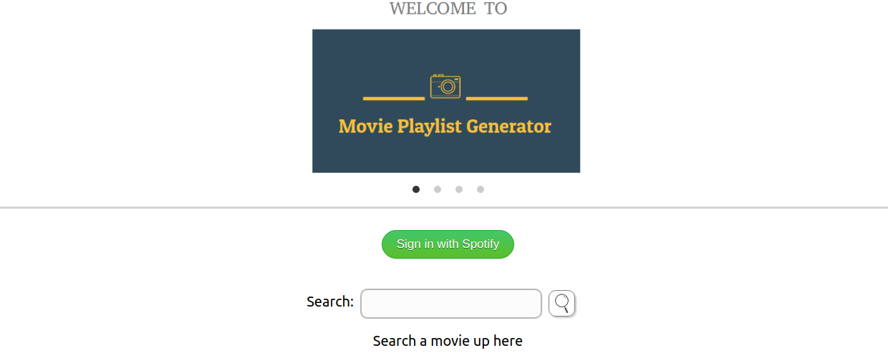
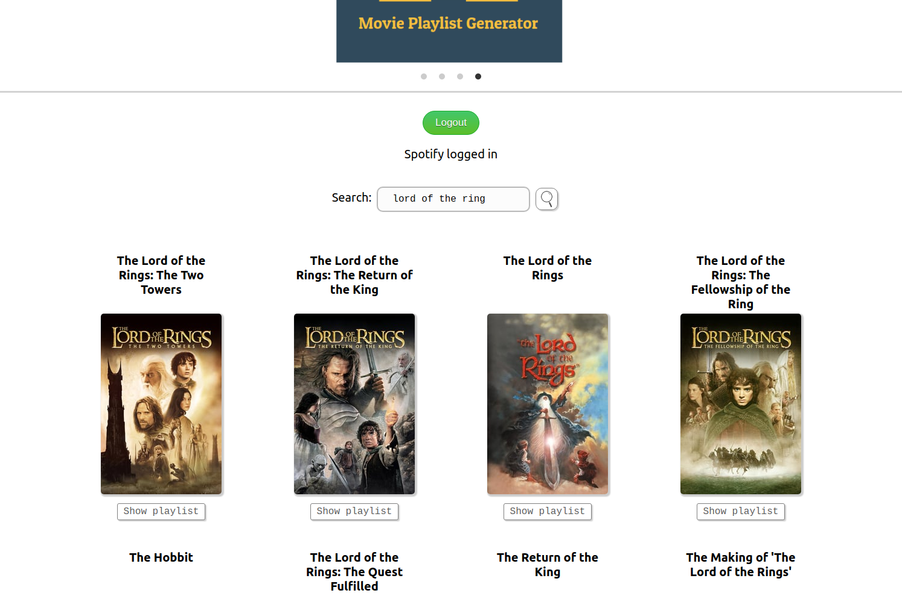
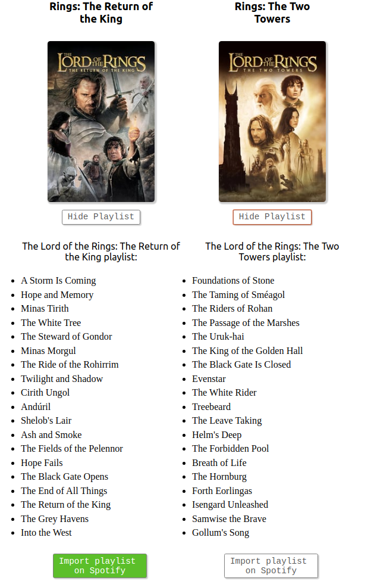
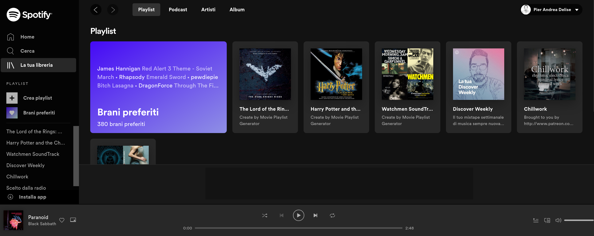

# Movie Playlist Generator

> A one-page website to automatically generate playlists from movies and import them on your Spotify account. 

## Implemented Features

* Login with Spotify.
* Search for movies using themoviedb API.
* Search for soundtracks using the Wikipedia API.
* Import them on Spotify using its API. 

## Screenshots

**Homepage**

**Searching for a movie**  

**Soundtracks**  

**Result** 

[Short video presentation](https://www.youtube.com/watch?v=k-WmimamBh0) 

## Usage

* Clone this repo in your local environment using `git clone`.

* Create the `.env` file in the client folder and add your MovieDb and Spotify API keys saving them as `REACT_APP_theMovieDb` and `REACT_APP_spotifyClientID` .

* Go to the client folder `cd /client`.

* `npm install` to begin dependencies installation.

* `npm start` to run it.

## Built with

* [React](https://reactjs.org/) - Front end library for building user interfaces

## Improvements

*“The trouble is, you think you have time.”*

The project was developed as part of the Codeworks bootcamp and it was the first project I worked on and I had only one week to deliver it. 

Here is a few things I would like to improve: 

* Write tests.
* Improve the login functionality (i.e. User token saved in local storage).
* Improve the soundtracks search functionality to include previously created playlist on Spotify.
* Check the images slider, sometimes it's not loading correctly after the user login. 

## Authors

* Pier Andrea Delise: [GitHub](https://github.com/pierandread) - [LinkedIn](https://www.linkedin.com/in/pier-andrea-delise/)

